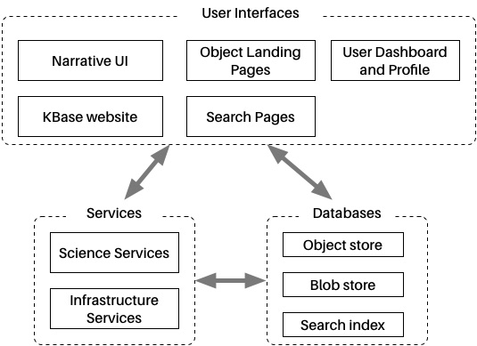
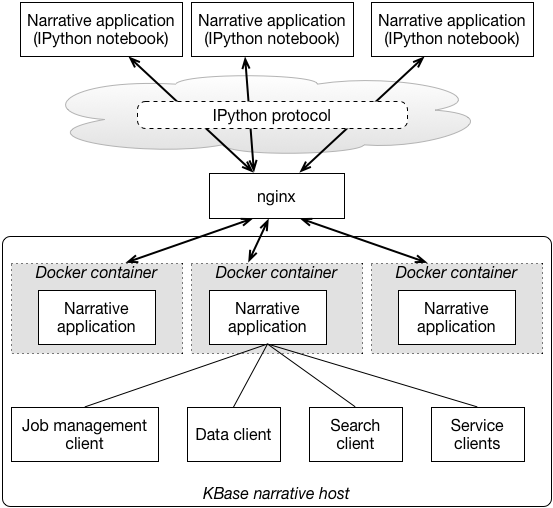
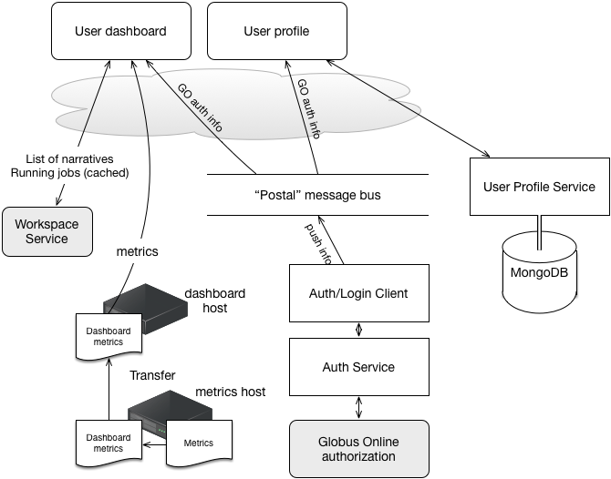
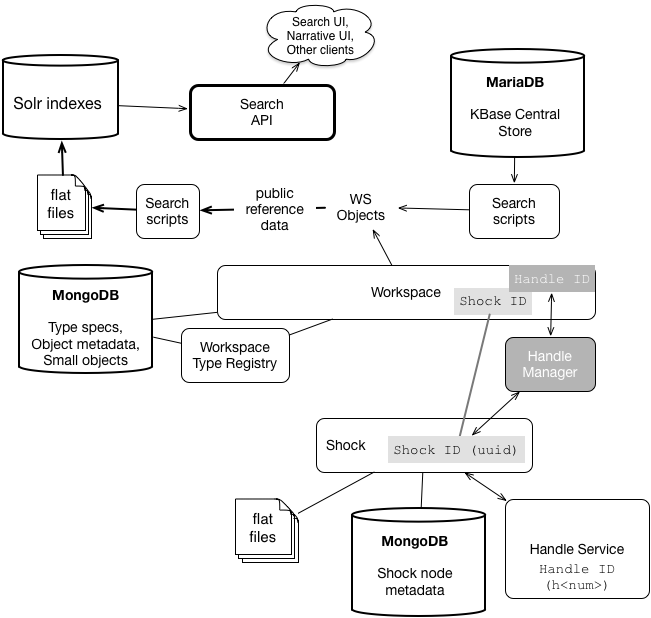
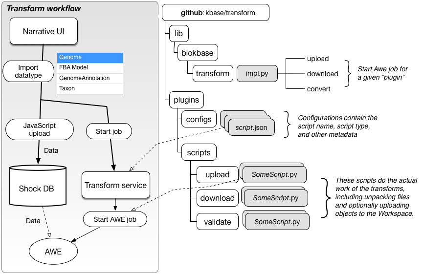

# KBase Architecture
Click on a box in the diagram, or the component name below, to see more details on that component.

* User Interfaces
    * Narrative UI
    * Functional Site
        * Object Landing Pages
        * User Dashboard and Profile
        * Search Pages
* Services
    * Science Services
    * Infrastructure Services
        * Transformation Service
* Databases

<map name="TableOfContents">
<area shape=rect coords="317,351,452,378" href="#search_index">
<area shape=rect coords="56,324,200,369" href="#infrastructure_services">
<area shape=rect coords="20,108,182,153" href="#functional_site">
<area shape=rect coords="371,45,515,90" href="#user_profile">
<area shape=rect coords="317,306,452,333" href="#blob_store">
<area shape=rect coords="317,261,452,288" href="#object_store">
<area shape=rect coords="209,108,353,153" href="#search">
<area shape=rect coords="209,45,353,90" href="#object_landing_pages">
<area shape=rect coords="20,45,182,90" href="#function">
<area shape=rect coords="56,261,200,306" href="#science_services">
</map>

# User Interfaces

In terms of implementation and deployment, KBase has two major user interface components: the Narrative UI and the  "functional site" web pages. The former is based on the IPython/Jupyter notebook, and is used to run all computations in the system. The latter provides social interfaces and status information, as well as the the data search and browsing capabilities. A minor UI component is the static website, [kbase.us](http://kbase.us), which is of course the entry point to the system for new users and provides documentation and some background information on the project.

## Narrative UI
The Narrative UI runs on top of the IPython notebook.
The diagram below shows how its deployment relates to the back-end components in KBase. Each Narrative UI running in a user's browser connects through the Internet using the IPython protocols to a running Python kernel. Each of these kernels is running inside a Docker container that includes the KBase interfaces and runtimes. To properly handle multiple users each with multiple Narrative UIs, the [nginx](https://www.nginx.com/) load balancer is used to route the traffic to and from the containers. Custom Lua extensions to Nginx are used to spin up new Docker containers on demand. 

</img>
 
Narrative deployment architecture

## Functional Site
The "functional site" is an umbrella term for all the web pages that are *not* either (a) static pages attached to the home page at http://kbase.us, or (b) the Narrative UI. They include the Search pages, the Object Landing Pages (that describe, e.g., genomes in the database), the User Profile page and the Dashboard.

<a id='object_landing_pages'>&nbsp;</a>
### Object Landing Pages
The KBase "landing page" is a single web page with all the information available in KBase for a given object. The landing pages are dynamically constructed using information available from the KBase main data store, the "workspace", and populated with JavaScript visualizations available in the KBase [ui-common](https://github.com/kbase/ui-common) repository.

For example, if you click on the three dots in "Rhodo_auto_anno" object in the DATA panel at left, then click on the binoculars, you will be taken to [this page](https://narrative.kbase.us/functional-site/#/dataview/11056/Rhodo_auto_anno). The page shows metadata, provenance, taxonomy, data about the assembly, etc.

<a id="user_profile">&nbsp;</a>
### User Profile and  Dashboard
The user profile and dashboard are both part of the KBase "functional site". Their implementation shares an Angular application with the Landing Pages, although this detail is subject to change.

These two components both use the [Postal message bus](https://github.com/postaljs/postal.js) component to queue updates pulled from the Globus Online back-end until they can be displayed on the web pages. The "Auth/Login Client" polls the KBase "Auth Service" to get new information for the user, and pushes this information onto the bus. Thus, updates to Globus Online metadata made through non-KBase interfaces can be, after a pause due to the poll interval, displayed automatically on the dashboard and user profile pages.

The User dashboard also communicates with the Workspace service to get the list of running jobs, and with a separate dashboard/metrics component to show user metrics that are periodically aggregated from the KBase logs.

</img> KBase functional site

&#8593; Back to top

<a id="search">&nbsp;</a>
### Search
KBase "search" builds on a separate database infrastructure from the workspace and "blob" store (Shock). Instead, it uses Solr to index data for full-text style search. The full pipeline is shown in the figure below.  In the figure, we show a pipeline that exports data from the KBase "Central Store" database. This is currently being augmented with a pipeline that imports data from NCBI and other sources. The "Shock" section of the diagram shows how the raw sequence data is stored, with a separate UUID that is tracked in a MongoDB server, and then a service called the "Handle manager" used to mediate permissions between Shock and the Workspace. The Workspace objects (which may link to Shock objects) are added into the pipeline for indexing with Solr. Finally the Search API provides an interface to querying Solr for records that, ultimately, must refer to Workspace objects that can be included in KBase Narratives.

</img> Search architecture

&#8593; Back to top

# Services

## Science Services

## Infrastructure Services
Infrastructure services can use the same protocols as the KBase Science Services, but they do not perform biology but rather act as "middleware".

### Transformation Service
One of the most important of these is the "Transformation Service", which performs conversion of data from files to KBase objects (upload) and from KBase objects back to files (download). This service is illustrated inthe diagram below. The "Transformation workflow" box onthe left shows the flow of actions that occurs for uploading (what the Narrative UI calls "Importing") data from the user's computer to KBase. The user first selects the type of data to be imported and the file; JavaScript code in the browser transfers the data from the local computer to the KBase blob store (Shock) database. Then the Narrative UI invokes the Transformation Service to start a "job" for the selected datatype. The Transform Service  uses code and configuration from the `kbase/transform` github repository to select and launch the transformation job on AWE; launching the job uses a Python library in `lib.biokbase.transform`. The transformation script itself pulls the data from the blob store and processes it into an object.

</img> 
Transformation Service architecture

<a id="upload_download">&nbsp;</a>
### Upload and Download
All the backend code for upload/download is in Transform, other than the model uploads and downloads that talk to the FBA service, which we do need to resolve.  The original concept for Transform was to have a central code repository for KBase uploads and downloads, to make development, testing, and maintenance simpler and easier, and promote code reuse.  

There are library modules with functions for python in `lib/biokbase/Transform` that handle many common and/or painful tasks like moving data to/from shock, getting a handle, etc.  Similar functions were implemented in a perl library under `lib/Bio` by the perl developers that contributed plugins to Transform.  There is no such library for Java in Transform at this time.

Also, there is good information in the [project_guides repo](https://github.com/kbase/project_guides/blob/master/How_to_add_a_new_data_type.md) about upload/download.

One thing that is missing from that document in project_guides is the Narrative UI portion.  Basically you need to touch `narrative_method_specs_ci` and `narrative develop` to modify or add upload/download types.  

There is code in the repo that would help with automated testing, currently in sort of an odd place, under `t/demo`.  If you look in `t/demo/bin`, there are some driver scripts that were meant to be used for development and testing of Transform plugins.  You can use `bin/upload_client.py` to test Transform in CI and production.

&#8593; Back to top

# Databases

There are three different types of databases being used in KBase: MongoDB, Solr, and Shock. Below is a cross-cutting summary of where each appears:

* __MongoDB__ - Back-end for the Workspace, metadata for Shock, backend for User Profile Service. [more info..](https://www.mongodb.org/)
* __Solr__ - Index of reference data for Search [more info..](http://lucene.apache.org/solr/)
* __Shock__ - In-house DB for storing "large" data objects (above MongoDB's record limit, ~16MB) [more info..](https://github.com/MG-RAST/Shock)

